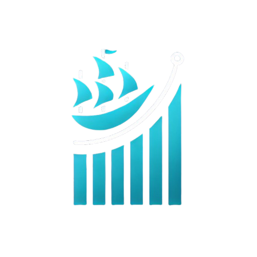

# **Finpro_NautixTech**



Proyek ini merupakan aplikasi berbasis Streamlit untuk **rating CV**, **chatbot AI**, dan berbagai fitur lainnya terkait HR.

## **Fitur Utama**
- 🚀 **Chatbot AI** (`Chatbot_AI.py`): Chatbot berbasis AI.
- 📄 **CV Rated** (`CV_Rated.py`): Menilai kualitas CV.
- 🏆 **Rank CV** (`Rank_CV.py`): Meranking CV berdasarkan skor tertentu.
- 🏢 **HR Recommendation** (`HR_Rated.py`): Rekomendasi terkait SDM.
- 🏠 **Home** (`Home.py`): Halaman utama aplikasi.

---

## **Instalasi & Menjalankan Aplikasi**

1. **Clone repositori ini**:
   ```bash
   git clone https://github.com/username/Finpro_NautixTech.git
   cd Finpro_NautixTech
   ```

2. **Buat virtual environment** *(Opsional tapi direkomendasikan)*
   ```bash
   python -m venv .venv
   source .venv/bin/activate  # Mac/Linux
   .venv\Scripts\activate      # Windows
   ```

3. **Instal dependensi**:
   ```bash
   pip install -r requirements.txt
   ```

4. **Jalankan aplikasi Streamlit**:
   ```bash
   streamlit run Home.py
   ```

---

## **Struktur Folder**
```
Finpro_NautixTech/
│── .venv/               # Virtual environment (opsional)
│── logo/                # Folder untuk assets/logo
│── pages/               # Folder untuk berbagai halaman aplikasi
│   ├── Chatbot_AI.py
│   ├── CV_Rated.py
│   ├── HR_Rated.py
│   ├── Rank_CV.py
│── Home.py              # Halaman utama aplikasi
│── requirements.txt     # File dependensi
│── README.md            # Dokumentasi proyek
```

---

## **Deploy ke GitHub**
Setelah selesai menyiapkan `README.md`, lakukan langkah berikut untuk mengupload ke GitHub:

```bash
git init
git add .
git commit -m "Initial commit"
git branch -M main
git remote add origin https://github.com/username/Finpro_NautixTech.git
git push -u origin main
```

Jangan lupa ganti `username` dengan akun GitHub-mu.

---

### **Kontributor**
- **Tatas Handharu S** - *Project Manager*
- **Fauzan Adnan S** - *Data Analyst*
- **Nur Chamidah** - *Data Science*
- **Andhika Dwija B** - *Data Engineer*


Jika ada saran atau pertanyaan, silakan buka *issue* atau *pull request* di repositori ini. 🚀

